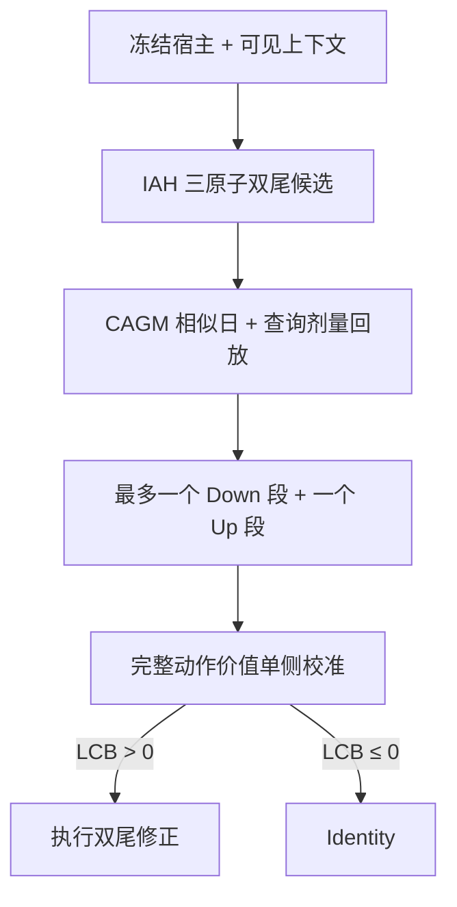

# HCH-v2 / IAH-CRPS v0.2 复审与 v0.3 精简收敛指令

> 日期：2026-08-12  
> 输入：`hch_v2_iah_crps_math_adjudication_v0.2_2026-08-12.md`  
> 当前裁决：**候选生成核心通过；整体暂不应标记 READY_FOR_ARCHITECTURE_FUSION。**  
> 建议状态：`CANDIDATE_CORE_ACCEPTED / DVG_REVISION_REQUIRED`  
> 本轮目标：只完成最后一次数学收敛，不改代码、不跑实验。

---

## 1. 总评

v0.2 已经把候选生成部分从“经验组合模块”提升为一条较完整的数学链：

\[
\text{冻结宿主}
\rightarrow
\text{宿主可测双曲坐标}
\rightarrow
\text{Identity 锚定三原子分布}
\rightarrow
\text{单一 CRPS}
\rightarrow
\text{双向动作剂量}.
\]

这部分符合项目对“简洁、统一、可推导”的要求，应作为 v2 的候选生成核心继续保留。

但 v0.2 后半段又引入了：外部 \(\beta\)-mixing 上界、奇偶阻断序列、normal-mixture confidence sequence、逐小时/方向/邻域前缀同时界、查询级 \(\rho\) 合同及全区间 weighted interval scheduling。它们各自有数学依据，却使系统出现两个问题：

1. **主算法难以真实运行**：实际电价数据通常无法给出可信的外部 \(\bar\beta(b)\) 和逐查询 \(\rho\)，于是所谓认证 DVG 几乎必然退化为全日 Identity；
2. **区间层在当前目标下数学退化**：weighted interval scheduling 实际等价于逐小时独立选择，不再构成连续事件模型。

因此，v0.2 不能以当前形式直接进入架构融合。需要保留前半段、重写后半段，把论文主线收敛为：

\[
\boxed{
\text{IAH 双尾候选}
\rightarrow
\text{CAGM 查询剂量回放}
\rightarrow
\text{双事件提案}
\rightarrow
\text{动作价值单侧校准}
\rightarrow
\text{价值}>0\text{才执行}
}
\]

这条主线与用户最初设想完全一致：**事件出现不等于应该修正；只有完整修正动作的可校准价值为正，才放行修正。**

---

## 2. v0.2 中可以直接接受的部分

### 2.1 日尺度与双曲坐标：接受，但不作为独立创新

保留：

\[
s_d=\frac1{H_d}\sum_h|x^0_{d,h}|,
\qquad
z=\operatorname{asinh}(x/s_d).
\]

优点是：只依赖冻结宿主、保持经济零点、允许负价、正比例等变、没有人为 floor。

边界：

- “可分、置换不变、连续、正齐次”类内的唯一性解释可以放附录；
- 不能宣称这是所有尺度函数中的唯一选择；
- asinh 与 CRPS 都不是新工具，创新只能来自后续结构化连接；
- 极小正尺度的数值稳定性属于实现回退规则，不应包装成新数学。

### 2.2 条件质量三原子 CRPS：公式通过

预测分布

\[
F=w^-\delta_{z^-}+w^0\delta_{z^0}+w^+\delta_{z^+}
\]

及损失

\[
\operatorname{CRPS}(F,z^Y)
=\sum_a w^a|z^Y-z^a|
-w^-(1-w^-)m^-
-w^+(1-w^+)m^+
\]

是标准离散 CRPS 的正确化简。它不是 MAE 加两个人工正则项。

固定质量时，外侧位置满足

\[
G(z^{-*}\mid Z)=\frac{w^-}{2},
\qquad
G(z^{+*}\mid Z)=1-\frac{w^+}{2},
\]

该推导正确。固定位置时，质量是 CDF 在相邻支持区间上的投影，也有清楚含义。

### 2.3 properness 边界：接受

v0.2 已正确区分：

- CRPS 本身的严格 properness；
- 结果前可测、可逆变换后的条件 properness；
- 固定 Identity 中心、三原子受限族的 CRPS 投影；
- “使用 proper score”不等于“三原子已经完整校准”。

该表述可以保留。

### 2.4 连续共享状态：接受

保留 S1 折外宿主预测中秩

\[
u_{d,h}=\mathcal R_{\mathcal P_h}(z^0_{d,h})\in[0,1].
\]

它符合项目已锁定的设计：低—正常—高是连续上下文，不做硬标签；上下尾共享；不使用当日目标；不增加 state loss。

### 2.5 查询剂量历史回放：接受，并视为强创新环节

保留查询日剂量在历史日重新施加：

\[
\widetilde z^{q,a}_{j,h}=z^0_{j,h}+\sigma_a m^q_{h,a},
\]

\[
g^{q,a}_{j,h}
=|z^Y_{j,h}-z^0_{j,h}|
-|z^Y_{j,h}-\widetilde z^{q,a}_{j,h}|.
\]

它回答的是“今天准备执行的这次修正，若施加到相似历史情景会怎样”，明显优于复用历史日自身不同剂量的收益。该环节应成为 CAGM 的核心，而不仅是一项实现细节。

---

## 3. 三个必须修正的问题

### 3.1 条件质量解除表示限制，但没有证明普通 CRPS 会学到 p99

v0.2 写道：\(w^+=0.02\) 时，上原子位置可对应 \(0.99\) 分位。这个结论只证明**模型有表示 p99 的能力**，没有证明联合 CRPS 最优解会选择 \(w^+=0.02\)。

联合优化时，质量与位置由式 (11) 和式 (13) 耦合。普通 CRPS 优化整个 CDF 的积分误差，通常更重视主体分布；当尾质量很小时，上原子的位置梯度也乘以 \(w^+\)，有限样本中恰恰可能更难学习尖峰。

因此必须把措辞从：

> 条件质量解决了罕见尖峰问题。

改为：

> 条件质量移除了固定 \(5/6\) 上原子的表示障碍；是否真正形成有效 p95/p99 尖峰剂量，是候选族的否决性实验问题。

本轮不建议再加入 tail-weighted CRPS 或额外尾部损失。先保留一个 CRPS，通过连续状态与外生条件让极端在条件分布中变得可辨认；若 half-exp 仍证明尖峰剂量不足，再把“尾部识别压力不足”作为第三版算法改进的明确问题。

### 3.2 当前 weighted interval scheduling 严格退化为逐小时选择

v0.2 定义

\[
L_{I,a}=\sum_{h\in I}b_{h,a},
\qquad b_{h,a}=m_{h,a}\ell_{h,a},
\]

然后允许选择任意数量、任意长度、互不重叠的带方向区间，并最大化总 \(L\)。由于单小时区间也合法，且没有每段成本、最短长度或事件数约束，最优解恒等价于

\[
\sum_h\max\{0,b_{h,-},b_{h,+}\}.
\]

证明很直接：

1. 任一包含负贡献小时的区间都可删除该小时或拆段而不变差；
2. 任一正贡献小时都可作为单小时区间单独选择；
3. 不同小时之间没有耦合成本；
4. 因而动态规划不会产生真正的事件结构，只是在包装逐小时 argmax。

所以“多连续事件的证据组装原则”目前不成立，weighted interval scheduling 也没有必要。

### 3.3 认证 DVG 过重且主路径不可用

当前定理要求同时获得：

- 可审计的 \(\beta\)-mixing 上界 \(\bar\beta(b)\)；
- 查询级迁移缺口 \(\rho_{q,h,a,p,k}\) 的有效上界；
- 足够多的独立历史块；
- 逐小时/方向/奇偶序列同时覆盖。

数学窗口也承认：没有这些量时必须 Identity。对真实电价市场而言，这些外部合同通常无法从有限数据可靠识别。因此该“认证模式”大概率只存在于定理中，而不会产生论文的主要实验动作。

这会带来一票否决风险：审稿人可能认为核心安全机制是 vacuous guarantee——保证成立的代价是算法几乎不工作。

建议删除以下内容作为主算法组成：

- 外部 \(\bar\beta(b)\) 合同；
- 奇偶块耦合；
- 逐小时 normal-mixture confidence sequence；
- 查询级 \(\rho\) 证书；
- “条件认证 DVG”作为论文中心主张。

这些可以压缩成附录中的理论边界：**真正无假设的 zero-shot 安全不可识别**。该负结论值得保留，但不应支配可运行算法。

---

## 4. 建议的 v0.3 唯一主架构

### 4.1 总流程



主线只保留三个职责：

1. **Bi-OMC / IAH**：生成下行与上行候选剂量；
2. **CAGM**：用历史情景评估今天的候选剂量；
3. **DVG**：校准完整动作是否真正有正价值。

连续状态与外生 token 是共享上下文，不单列创新。

### 4.2 双事件提案，而不是无限区间拼装

第二版先采用一个明确且不退化的结构约束：

> 每个预测日最多提出一个 Down 连续区间和一个 Up 连续区间，两者不得重叠；任一方向可以为空。

这不是经验事件阈值，而是由双尾动作空间直接产生的结构：一个日允许同时出现一个主要低价事件与一个主要尖峰事件。

对 CAGM 历史回放得到的逐时预测收益 \(\widehat g_{q,h,a}\)，求解

\[
(I_q^-,I_q^+)
=\arg\max_{I^-\cap I^+=\varnothing}
\left[
\sum_{h\in I^-}\widehat g_{q,h,-}
+\sum_{h\in I^+}\widehat g_{q,h,+}
\right],
\tag{A}
\]

其中 \(I^-\)、\(I^+\) 都允许为空。\(H=24\) 时可以精确枚举，无需软边界、最短长度、事件阈值或区间数超参数。

它比 v0.2 更合适：

- 能同时修正低价/负价与尖峰；
- 连续区间真正影响解，不会退化为逐小时动作；
- 没有任意事件数 \(K\)；
- 符合第二版“完整但不过度复杂”的定位；
- 多个同方向事件可留作后续由实验问题驱动的扩展。

### 4.3 CAGM 只输出一个可审计的动作价值

记由式 (A) 得到的整日候选动作向量为 \(\pi_q\)。CAGM 在冻结历史记忆中检索相似日，并对每个历史日回放**同一个 \(\pi_q\)**，得到整日实现收益：

\[
A_{q\rightarrow j}
=\sum_h
\left(
|z^Y_{j,h}-z^0_{j,h}|
-|z^Y_{j,h}-z^{\pi_q}_{q\rightarrow j,h}|
\right).
\tag{B}
\]

以预先冻结的邻域规则得到预测动作价值：

\[
\widehat A_q
=\frac1k\sum_{j\in N_k(q)}A_{q\rightarrow j}.
\tag{C}
\]

第二版只允许一个 \(k\)，在 S3-M 内用时间前向验证选择并冻结；S4 不扫描多个 \(k\)，不再建立邻域前缀置信序列。\(k\) 是估计器复杂度，不是论文创新点。

### 4.4 DVG 改为“选择后动作价值校准”

把 S3 明确拆成：

- **S3-M**：建立冻结记忆、选择邻域规则和双事件提案策略；
- **S3-C**：不再更新上述对象，只运行完整策略并校准其价值误差。

对每个按时间顺序的 S3-C 伪查询 \(t\)：

1. 在不知道 \(Y_t\) 时产生完整动作 \(\pi_t\) 和预测价值 \(\widehat A_t\)；
2. 结果出现后计算该动作的真实双曲收益 \(A_t\)；
3. 定义过度乐观误差

\[
E_t=\widehat A_t-A_t.
\tag{D}
\]

用 S3-C 的 \(E_t\) 建立单侧校准分位 \(q_{1-\alpha}\)，S4 对查询日计算

\[
\operatorname{LCB}_q
=\widehat A_q-q_{1-\alpha}.
\tag{E}
\]

最终决策：

\[
\pi_q^{\mathrm{final}}
=
\begin{cases}
\pi_q,& \operatorname{LCB}_q>0,\\
\mathrm{Identity},& \operatorname{LCB}_q\le0.
\end{cases}
\tag{F}
\]

这正是本项目最初想要的校验门：不是“检测到极端就修正”，而是“先形成完整修正，再校准这次修正是否有正价值”。

### 4.5 统计主张必须保持克制

若 S3-C 与未来查询满足交换性，采用标准 split-conformal 次序统计量时，式 (E) 可以给完整策略实现收益的单侧边际覆盖。电价序列通常不严格交换，因此第二版应采用：

- 时间顺序固定的 S3-C；
- 以完整日为校准单元；
- 预先规定的 seasonal/block sensitivity；
- 报告经验覆盖率、错误放行率、释放率和 Identity 率；
- 正式措辞为“time-ordered conformalized action-value gate”或“empirically calibrated lower action value”。

除非另有严格证明，不宣称任意非平稳时间序列上的有限样本分布无关安全。

这个边界比 v0.2 的不可用强证书更诚实，也更适合 WWW/KDD：算法真实运行、校准对象直接对应决策、所有失败都能在 S4 被量化。

### 4.6 冻结协议由此自然闭合

最终五阶段为：

1. **S1**：训练宿主并冻结；生成后续样本外宿主预测和连续状态参考；
2. **S2**：训练 IAH 条件质量三原子候选器并冻结；
3. **S3-M**：构建 CAGM 记忆，冻结距离、\(k\) 与双事件提案规则；
4. **S3-C**：运行完整冻结策略，只估计单侧价值校准量 \(q_{1-\alpha}\)；随后冻结完整 corrector bundle；
5. **S4**：只用预测前信息生成候选、提案和 LCB；不读取标签、不更新模型、不更新校准量。

这比 v0.2 的 S3 同时承担记忆、阻断、混合上界与迁移合同更清楚，也便于以后真正做冻结实验。

---

## 5. 创新主线应如何表述

不要把论文写成 “asinh + CRPS + W1 + conformal + interval DP” 五个工具的拼盘。统一问题应是：

> 冻结宿主在双尾事件中会产生方向性、幅值不等的错误；但极端出现并不代表任意校正都值得执行。HCH-v2 先在保持零点和尺度等变的坐标中学习 Identity 锚定的双尾条件动作，再用相似历史情景回放查询日剂量，最后直接校准所提议完整动作的正价值，只在校准下界大于零时偏离宿主。

三层差异化：

1. **候选层**：不是普通 residual head，而是 Identity 锚定、条件质量与双向位移共同组成的受限概率动作族；
2. **证据层**：不是复用历史修正器收益，而是回放今天的候选剂量；
3. **决策层**：不是检测到事件即修正，也不是校准预测区间，而是校准已经完成区间选择后的动作价值。

这样三层围绕同一个对象——**相对 Identity 的动作收益**——贯穿，而不是模块拼盘。

---

## 6. v0.3 需要数学窗口回答的五个问题

请数学窗口基于本文只回答以下五项，不再扩展新模块。

### Q1. 条件质量三原子联合总体最优的准确含义

- 补充说明式 (11) 与式 (13) 是耦合的一阶/投影条件；
- 删除“已解决罕见尖峰”的过强措辞；
- 分析小质量导致弱位置梯度的问题；
- 不引入新的 tail loss，给出必须由实验验证的尾部充分性条件。

### Q2. 双事件提案的闭式或精确算法

- 对式 (A) 给出精确定义；
- 证明允许空区间且最多一上/一下时不会退化为逐小时独立动作；
- 给出 \(H=24\) 的精确复杂度；
- 明确同日只有一个方向、两个方向或无动作的情况。

### Q3. CAGM 整日动作价值

- 明确逐时收益如何聚合为式 (B)；
- 规定检索距离、邻居数 \(k\) 与 tie-break 的冻结方式；
- 证明查询侧不读结果；
- 说明使用受限三原子分布作 key 只是可证伪充分性假设。

### Q4. 单侧动作价值校准

- 给出 S3-C 下标准单侧 split-conformal 次序统计量的精确索引；
- 证明“先选择动作、后校准完整策略”的合法条件；
- 明确校准单位是整日动作，而不是 600 个区间；
- 区分交换性理论覆盖、时间序列经验覆盖与 zero-shot 无保证三种措辞。

### Q5. 最终论文定理与主张

最终只保留：

1. 双曲尺度等变与零点连续；
2. 三原子 CRPS 及固定质量下的外侧分位条件；
3. 查询剂量回放的有界收益；
4. 双事件提案的结构性质；
5. 在列明校准条件下，选择后动作价值的单侧覆盖。

删除以外部 \(\beta\)-mixing 和逐查询 \(\rho\) 为前提的主定理。零样本无条件安全不可识别可保留为边界命题或讨论。

---

## 7. v0.3 输出约束

请生成一份新的完整数学设计，建议文件名：

```text
hch_v2_iah_crps_final_math_core_v0.3_2026-08-12.md
```

要求：

- 正文控制在 v0.2 的约一半以内；
- 只保留一套符号、一条训练目标、一条检索/回放路径和一条门控路径；
- 不再加入 Student-t、HMM、额外 loss、随机 metric、\(\beta\)-mixing 证书或查询级 \(\rho\)；
- 连续状态与任意外生 token 保留为共享条件，不单列创新；
- 数学结论、统计假设和经验设计严格分层；
- 每个公式都必须服务“候选 → 历史证据 → 正价值决策”主线；
- 不写代码，不展开 half-exp，不修改仓库；
- 最终状态只能在 Q1–Q5 闭合后标 `READY_FOR_ARCHITECTURE_FUSION`。

---

## 8. 最终裁决

| 部分 | 裁决 | 原因 |
|---|---|---|
| 双曲零保持坐标 | 保留 | 简单、符号友好、尺度等变，但不是单独创新 |
| 条件质量三原子 CRPS | 保留 | 单一 proper score、动作结构清楚；尖峰能力仍待实验 |
| 连续共享状态 | 保留 | 与用户原始自适应低/正常/高思想一致，无硬标签 |
| 残差分布 W1 检索 | 暂保留 | 简洁但依赖候选分布充分性，必须可证伪 |
| 查询剂量历史回放 | 强保留 | 最具项目辨识度的环节之一 |
| 逐小时 CS + \(\beta\) + \(\rho\) | 从主算法删除 | 复杂、难以识别、容易形成 vacuous guarantee |
| 任意多区间 WIS | 删除 | 当前目标严格退化为逐小时选择 |
| 一 Down + 一 Up 双事件提案 | 替换采用 | 对应双尾物理结构，连续、简单、可精确求解 |
| 选择后动作价值单侧校准 | 采用 | 直接落实“价值 > 0 才修正”，与 SCARR 思路衔接 |

总体结论：**v0.2 的数学前半段已经成型；最后一次修改不应继续增加数学装置，而应把 DVG 从“无法落地的全条件安全证书”改造成“对完整双尾动作价值进行时间顺序单侧校准的冻结门控”。完成该收敛后，才适合与代码修复、冻结 bundle 和 half-exp 协议统一融合。**
