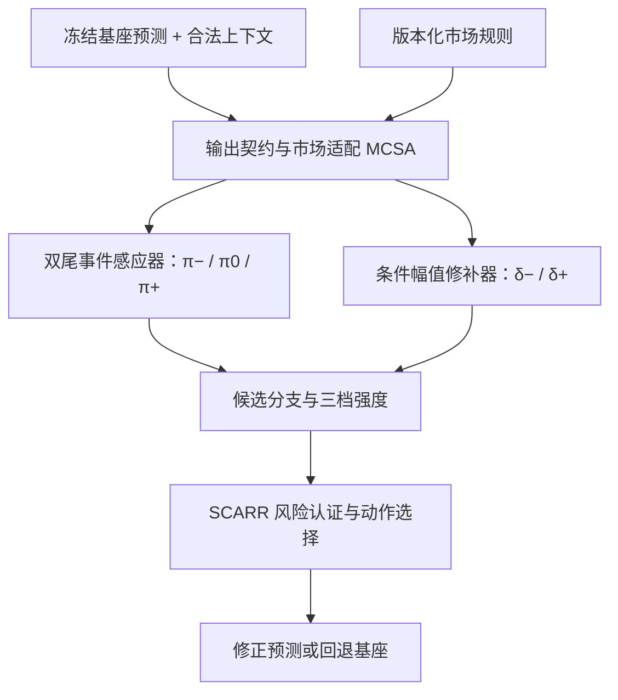

# BOM-SSC / SCARR 架构 v2.1：四问驱动的完整改良设计

**文档日期：**2026-08-01  
**文档性质：**研究架构设计稿，不是实验结果、理论证明或全球首创权声明  
**研究对象：**冻结异构基座之上的绝对电价点预测后处理，重点修复负电价与正向尖峰  
**论文结构：**一个主创新 BOM-SSC + 一个内部风险层 SCARR  

---

## 0. 执行摘要

原 v2 架构已经抓住了“冻结基座、双尾、occurrence–magnitude、三档动作”四个正确方向，但仍存在四个会影响论文成立性的缺陷：

1. 把“负电价”和“负残差”混成同一个状态；
2. 只写 tail-conditional 非降级，丢掉了阶段二已经确认的正常期保护预算；
3. 默认路由器可以按真实尾部状态行动，形成运行时不可见标签与潜在 oracle；
4. 把“接口可兼容”写成“参数可零样本跨模型/跨市场”，并把有限样本条件保证说得过强。

v2.1 采用以下不可回退的改良：

- **价格事件与残差方向解耦：**价格状态 \(Z_t\) 回答“负价、正常还是正尖峰”，残差方向 \(D_t\) 回答“基座应向下还是向上修”；二者不再混用。
- **正常—双尾三组安全：**正常期动作 harm budget 是硬约束，负尾与正尾分别设置风险预算和修复收益目标。
- **无 oracle 路由：**运行时只使用可获得特征、基座预测和预测事件概率；真实尾部标签只用于独立认证与事后诊断。
- **主干无关、市场有条件：**准确定位为 backbone-agnostic interface、market-conditioned calibration；零样本参数通用性必须另行证明。
- **一条主线：**BOM-SSC 生成有符号双尾修补候选；SCARR 作为内部风险层选择回退、缩减或完整修补。动态图和经济 loss 不再成为独立模块。
- **诚实保证：**有限样本声明只对预先定义的风险、分组、候选策略和明确统计假设成立；电价时序下不能直接照搬 i.i.d. 结论。

### v2.1 的安全贡献表述

> 我们研究冻结异构电价基座的有符号双尾后处理：用运行时可预测的价格事件概率生成 occurrence–magnitude 残差修补候选，并在正常、负尾和正尾三个真实子群上独立审计相对基座的动作诱发损失。系统只在预注册风险预算允许时执行缩减或完整修补，否则回退原预测。

该表述不包含“首个”“市场无关”或“分布无关逐点安全”等尚未被证明的主张。

---

## 1. 四问对应的设计裁决

| 关键问题 | 原 v2 判定 | v2.1 裁决 | 架构改良落点 |
|---|---|---|---|
| Q1 多模型适配 | 部分覆盖 | **可做接口兼容；参数通用性待证** | C0–C4 兼容等级、统一输出契约、rolling-OOS 残差库、跨基座留一验证 |
| Q2 市场迁移 | 明显缺口 | **改为 market-conditioned，而非 market-free** | 市场规则与尺度适配器 MCSA、三种迁移协议、目标市场独立校准 |
| Q3 负电价独到性 | 概念混淆 | **价格事件与残差方向彻底解耦** | \(Z_t\) 价格状态、\(D_t\) 残差方向、双分支 magnitude head、负价专属指标 |
| Q4 准确率与经济价值 | 目标过度承诺 | **安全约束优先，尾部改善主目标，经济价值次级验证** | 正常/负尾/正尾三组预算、Pareto 选择、固定下游决策任务 |

---

## 2. 研究问题与边界

### 2.1 任务定义

给定任意冻结点预测基座 \(f_b\)：

\[
\hat{\mathbf y}^{(0)}_t=f_b(\mathcal I_t),
\]

其中 \(\mathcal I_t\) 只能包含预测时刻合法可见的信息。BOM-SSC 不读取基座隐藏层、梯度、注意力权重或内部参数，只接收：

- 基座点预测 \(\hat{\mathbf y}^{(0)}_t\)；
- 合法可获得的外生特征与时间特征；
- 可选基座身份或基座误差摘要；
- 严格 rolling-OOS 的历史预测与残差；
- 版本化的市场规则和目标语义元数据。

模块输出修正预测：

\[
\hat{\mathbf y}_t
=
\Pi_m\!\left(
\hat{\mathbf y}^{(0)}_t+a_t\hat{\boldsymbol\delta}^{(q_t)}_t
\right),
\]

其中：

- \(q_t\in\{-,+,\varnothing\}\) 为选择的负尾、正尾或回退分支；
- \(a_t\in\{0,\lambda,1\}\) 为回退、缩减或完整修补强度；
- \(\Pi_m\) 是可选的市场可行域投影，只使用有官方依据的价格上下限；
- 当证据不足或风险认证失败时，强制 \(a_t=0\)。

### 2.2 不在本文范围内

- 不修改或重新训练基座内部结构；
- 不声称解决完整报量报价或市场出清优化；
- 不把 DART spread 预测等同于绝对日前/实时电价预测；
- 不把可选图结构解释为因果关系；
- 不承诺同一组校正器参数零样本适配任意模型和市场；
- 不把经济收益替代为统计校准或安全性的证明。

本文最多可表述为：**为电力交易报量报价提供更稳健的价格预测与风险信息支持**。

---

## 3. 核心语义：价格事件与残差方向解耦

### 3.1 真实价格事件状态

对市场 \(m\) 与预测时段 \(h\)，定义预注册事件状态：

\[
Z_{t,h}=
\begin{cases}
-, & y_{t,h}<\tau^-_m,\\
+, & y_{t,h}>\tau^+_{m,h},\\
0, & \text{otherwise}.
\end{cases}
\]

- 对允许并具有明确经济语义的负电价市场，\(\tau^-_m\) 可预注册为 0；
- 若市场不允许负价，负尾分支应被关闭，而不是人为制造“负价”标签；
- 正尖峰阈值 \(\tau^+_{m,h}\) 只能来自训练期统计量或事前规则，不能用 calibration/test 调整；
- 若采用分位数阈值，应按市场和必要的时段桶确定，并固定版本。

同时保留语义负价指示量

\[
N_{t,h}=\mathbf 1[y_{t,h}<0].
\]

如果 \(\tau^-_m<0\)，则“极端负尾”只是全部负电价中的更严格子集。论文必须分别报告“是否出现负电价”与“是否进入可修补的极端负尾”，不能把二者混成一个标签。

### 3.2 基座残差与修正方向

定义严格样本外残差：

\[
r_{t,h}=y_{t,h}-\hat y^{(0)}_{t,h},
\qquad
D_{t,h}=\operatorname{sign}(r_{t,h}).
\]

这里：

- \(Z=-\) 表示真实价格属于负价/下尾事件；
- \(D=-\) 表示基座预测过高，需要向下修；
- 两者相关但不等价。

因此禁止再使用“\(-\) 态同时代表负电价和负残差”的定义。正价格可能对应负残差，负电价也可能在某些基座下产生正残差。

### 3.3 运行时事件概率

预测时真实 \(Z_{t,h}\) 不可见。事件感应器只能输出：

\[
\boldsymbol\pi_{t,h}
=
\bigl(
P(Z=-\mid\mathcal O_{t,h}),
P(Z=0\mid\mathcal O_{t,h}),
P(Z=+\mid\mathcal O_{t,h})
\bigr),
\]

其中 \(\mathcal O_{t,h}\) 只包含运行时可见变量。路由器可以使用 \(\boldsymbol\pi\)、不确定性和预测分组 \(\hat Z\)，但不能使用真实 \(Z\)。真实 \(Z\) 仅用于：

1. 独立认证集上的策略筛选；
2. 测试期负尾/正常/正尾分组报告；
3. 不参与当前时点动作选择的延迟更新。

---

## 4. v2.1 总体架构

### 4.1 模块 A：基座输出契约层（Base Forecast Contract）

职责是把不同基座输出转换为统一契约，而不是读取模型内部：

- 统一预测目标、市场、节点/区域、日期、时段和 horizon；
- 标记点预测来源、训练截止时间和基座版本；
- 检查预测是否为真实 rolling-OOS；
- 对多节点 STGNN 只做位置索引映射，不读取图嵌入；
- 对概率基座默认选择预注册点预测（如中位数）作为 \(\hat y^{(0)}\)，概率分布适配不属于主张范围。

必要字段示意：

| 字段 | 含义 | 是否必需 |
|---|---|---:|
| `market_id` / `rule_version` | 市场及规则版本 | 是 |
| `target_kind` | `da_absolute`、`rt_absolute` 等 | 是 |
| `location_id` | 区域、节点或统一市场标识 | 是 |
| `forecast_origin` / `horizon` | 预测起点和时距 | 是 |
| `base_model_id` / `base_family` | 基座身份与模型家族 | 是 |
| `y_hat_base` | 冻结基座点预测 | 是 |
| `available_features` | 截止时刻合法特征 | 可选 |
| `base_train_cutoff` | 基座训练信息边界 | 是 |

### 4.2 模块 B：市场条件与尺度适配器（MCSA）

MCSA 不把市场规则简单拼成普通特征，而是用于参数化四件事：

1. **事件定义：**负价阈值、正尖峰阈值和有效价格范围；
2. **尺度归一：**市场/时段训练期中心与稳健尺度；
3. **校准分层：**目标市场、时段桶、位置类型与规则版本；
4. **经济模拟：**决定可使用哪一种下游价值评估，而不是让网络自行猜测市场制度。

建议元数据：

| 元数据 | 架构用途 |
|---|---|
| 币种与价格单位 | 统一尺度与经济指标 |
| 市场允许的价格上下限 | 可行域投影与异常检查 |
| 是否允许负价、负价语义阈值 | 开关负尾分支与定义标签 |
| DA/RT/价差目标类型 | 防止任务偷换 |
| 时间分辨率、时区、DST 规则 | 对齐 horizon 与日内位置 |
| 节点/区域/全市场价格类型 | 确定空间索引和校准层级 |
| 预测与申报信息截止时间 | 定义合法信息集 |
| 规则生效日期与官方来源 | 防止跨规则版本混训 |

山东、山西等国内市场的具体取值必须从相应时期的官方规则文件提取并版本化；在规则未核验前，架构文档只定义字段，不臆造价格帽、结算方式或节点语义。

### 4.3 模块 C：双尾事件感应器（Occurrence Sensor）

事件感应器预测 \(\boldsymbol\pi\)，解决“是否属于哪一侧价格尾部”，而不是直接预测残差符号。推荐采用共享编码器 + 三分类头，或两个互斥二元头：

- 负价/下尾发生概率 \(\pi^-\)；
- 正尖峰发生概率 \(\pi^+\)；
- 正常概率由显式第三头或互斥归一得到。

训练目标以类别不平衡友好的 occurrence loss 为主；任何重采样或加权方案必须只使用训练期标签，并在校准前冻结。

### 4.4 模块 D：条件幅值修补器（Magnitude Corrector）

幅值头分别学习：

\[
\hat\delta^-_{t,h}\approx
\mathbb E[r_{t,h}\mid Z_{t,h}=-,\mathcal O_{t,h}],
\]

\[
\hat\delta^+_{t,h}\approx
\mathbb E[r_{t,h}\mid Z_{t,h}=+,\mathcal O_{t,h}].
\]

核心规则：

- 负尾与正尾不能只共享最后一个无符号回归头；
- magnitude target 是严格 OOS 基座残差，不是训练内拟合残差；
- 正常期默认不设自由修补头，减少退化和“普通残差校正”重合；
- 可共享低层表示，但尾部 head、损失与诊断必须分开；
- 输出必须经过训练期尺度逆变换，并可选执行市场可行域投影。

### 4.5 模块 E：候选动作生成

先选择尾部分支 \(q_t\)，再选择修补强度 \(a_t\)：

\[
q_t\in\{-,+,\varnothing\},
\qquad
a_t\in\{0,\lambda,1\}.
\]

候选动作集合不是简单的三条数值，而是：

- `BASE`：\(q=\varnothing,a=0\)；
- `NEG_SHRINK` / `NEG_FULL`；
- `POS_SHRINK` / `POS_FULL`。

当 \(\pi^-\) 与 \(\pi^+\) 同时不确定、预测置信度不足、分组样本不足或风险上界超预算时，必须选择 `BASE`。

\(\lambda\) 只能从预注册候选集合中选择，不能在最终认证集或测试集上调节。

### 4.6 模块 F：SCARR 风险层

SCARR 不再被定义为新的通用 conformal 框架，而是 BOM-SSC 的策略认证与动作选择层。

对任一候选动作 \(a\)，定义相对基座的动作诱发损失：

\[
\Delta\ell_{t,h}(a)
=
\ell_m\!\left(y_{t,h},\hat y_{t,h}(a)\right)
-
\ell_m\!\left(y_{t,h},\hat y^{(0)}_{t,h}\right),
\]

以及有害部分：

\[
L^{\mathrm{harm}}_{t,h}(a)
=
\min\left\{[\Delta\ell_{t,h}(a)]_+,B\right\}.
\]

这里使用“动作诱发损失”而不是在摘要中笼统称“反事实因果损失”；所有候选预测在真值到达后都可以被离线计算，并不自动构成因果识别。

运行时动作规则必须预先固定：

1. 若 \(\max(\pi^-,\pi^+)\) 未超过事件阈值，选择 `BASE`；
2. 否则选择尾部概率更高且满足预注册 margin 的分支；
3. 根据市场、horizon、预测概率桶和分支，查询认证阶段生成的动作表；
4. 在风险预算内选择允许的最大强度；若该单元无证书或样本不足，选择 `BASE`；
5. 输出经过可选市场可行域投影的预测。

该动作表本身必须随最终策略一起在真实三组上通过独立认证，不能只凭预测分组上的平均风险上线。

---

## 5. 正常—双尾三组安全预算与有限样本口径

### 5.1 三个真实子群的策略级预算

对一个只使用运行时可见变量的固定策略 \(\pi_\theta\)，在独立认证集上分别定义：

\[
R_g(\theta)
=
\mathbb E\left[
L^{\mathrm{harm}}(\pi_\theta)\mid Z=g
\right],
\qquad g\in\{-,0,+\}.
\]

可行策略必须同时满足：

\[
R_0(\theta)\le\varepsilon_0,
\qquad
R_-(\theta)\le\varepsilon_-,
\qquad
R_+(\theta)\le\varepsilon_+.
\]

其中：

- \(\varepsilon_0\) 是正常期保护预算，必须保留且通常最严格；
- \(\varepsilon_-\)、\(\varepsilon_+\) 分别约束负尾和正尾中的校正伤害；
- 尾部改善是可行集内的优化目标，不能通过放宽正常期预算换取；
- 永远存在 `always-base` 安全回退策略。

每个真实子群还必须达到预注册的最小认证样本量。若某尾部样本不足，只能标注“该组未获认证”并回退或缩小主张，不能借正常组或其他市场样本冒充该尾部保证。

真实 \(Z\) 可以在独立认证集上用于**筛选整个策略**，但不能被运行时路由器直接读取。这避免了 oracle，同时允许事前淘汰会伤害真实正常期的候选策略。

### 5.2 运行时分层与真实分组认证的区别

| 分组 | 是否在决策时可见 | 用途 | 允许的主张 |
|---|---:|---|---|
| 市场、规则版本、时段桶 | 是 | 校准层与路由上下文 | 可做运行时分层风险控制 |
| 预测事件组 \(\hat Z\) / 概率桶 | 是 | 选择分支与动作强度 | 可对预测分层报告风险 |
| 真实事件组 \(Z\) | 否 | 独立策略认证与测试诊断 | 只能做策略级子群保证/审计，不能称逐点已知 |

### 5.3 可发表的保证口径

如果采用 LTT/CRC 类风险认证，必须预先固定：

- 有界风险函数；
- 候选策略集合；
- 分组定义与合并规则；
- 每组风险预算与置信水平；
- 多组/多策略的错误率校正；
- 用于选策略和用于认证的独立数据边界。

只有在满足相应统计假设时，才可表述为“有限样本组风险上界”。不能表述为：

- 每个极端样本都不会退化；
- 任意条件下的 distribution-free conditional coverage；
- i.i.d. 证明自动适用于连续电价时序；
- 真实尾部在动作执行前已经被知道。

### 5.4 电价依赖序列的处理

主实验采用**冻结策略 + 严格时间外测试**，不在测试期根据真值即时更新。认证可按市场日或周建立 block-level loss，减少日内强相关造成的伪独立。

理论声明需二选一：

1. 明确假设 calibration blocks 可交换，并只在该假设下给出有限样本结论；
2. 若无法证明，降级为经验风险认证，报告 rolling drift、失效率和置信区间，不使用“严格分布无关”字样。

在线 delayed-feedback 版本可作为后续扩展，必须重新认证，不能与离线固定策略共用同一保证。

---

## 6. Q1：多模型适配能力的完整设计

### 6.1 两种“模型无关”必须分开

| 主张 | 定义 | v2.1 状态 |
|---|---|---|
| 接口无关 | 不读取隐藏层/梯度，只用冻结输出、合法特征和 OOS 残差 | **架构可保证** |
| 训练流程无关 | 任一基座都可按同一流程生成残差并训练后处理器 | **可检验** |
| 参数跨基座通用 | 同一组 BOM-SSC 参数无需再训练即可用于未见基座 | **不能预设，需 leave-one-family-out 证明** |
| 性能普遍提升 | 所有基座都显著变好 | **不承诺；允许安全回退或冗余** |

因此论文宜使用 **backbone-agnostic interface**，而不是未经验证的 universal corrector。

### 6.2 C0–C4 兼容等级

| 等级 | 模块可获得信息 | 能力边界 |
|---|---|---|
| C0 输出接入 | 当前基座点预测 | 只能检查格式/范围，无法学习可靠修补 |
| C1 残差校准 | rolling-OOS 基座预测与真值 | BOM-SSC 最低可运行条件 |
| C2 上下文增强 | C1 + 合法外生/时间特征 | 完整事件感应与幅值修补 |
| C3 结构输出 | C2 + 多节点/多 horizon 映射 | 可适配 STGNN、多区域或 24/96 点输出 |
| C4 市场条件 | C3 + 规则版本与目标市场校准集 | 市场条件风险认证与迁移评估 |

“即插即用”只能表示接口统一，不表示 C0 即可获得完整能力。论文必须公布每个基座达到的兼容等级。

### 6.3 基座实验矩阵

至少覆盖五类互异基座：

1. 线性/统计：LEAR、DLinear 或等价线性强基线；
2. 树模型：LightGBM；
3. MLP/RNN：MLP 或 LSTM；
4. Transformer：PatchTST 等；
5. 结构/基础模型：具有合法空间目标的 STGNN，或 Chronos/TimesFM 类 TSFM。

全部基座必须冻结，并使用同一信息截止口径。不得让 BOM-SSC 读取某一基座特有的中间表示。

### 6.4 必做消融与失败边界

| 实验 | 回答的问题 |
|---|---|
| 每基座单独训练 vs 跨基座共享正确器 | 通用性来自接口还是共享参数 |
| 模型身份 on/off/unknown token | 是否依赖已见基座身份 |
| leave-one-backbone-family-out | 未见模型家族能否适配 |
| one-head residual vs signed two-part | 双尾分解是否必要 |
| 正常期预算 on/off | 安全来自哪里 |
| 仅基座输出 vs 加合法上下文 | 模块对特征的依赖边界 |

应主动报告以下失效/冗余场景：基座尾部已被充分校准、OOS 残差没有稳定结构、尾部样本不足、基座输出被裁剪、目标/时距不一致、严重概念漂移或目标市场没有负价机制。

Transformer 或 STGNN 已经使用丰富上下文本身并不能证明后处理器冗余；v2.1 不读取其内部表示，是否冗余只能由严格 OOS 残差是否仍具可预测的尾部结构，以及加入校正后的净收益/伤害实证决定。

---

## 7. Q2：市场迁移与 MCSA 具体设计

### 7.1 三种迁移任务不能混写

| 协议 | 目标市场可用数据 | 可声明的能力 |
|---|---|---|
| In-market | 完整训练 + 独立 calibration | 市场内安全校正 |
| Few-shot target calibration | 共享 corrector + 少量目标市场 calibration | 低样本市场条件适配 |
| Zero-shot market | 无目标真值与 calibration | 只能做探索性泛化；无额外 shift 假设时不能声称分布无关安全 |

主论文建议采用“跨市场共享表示/修补器 + 目标市场独立风险校准”。这既保留跨市场价值，也不虚构零样本保证。

### 7.2 分层校准键

可预注册校准键：

\[
C=(\text{market},\text{rule version},\text{horizon bucket},\hat Z,\text{action}).
\]

必须设置最小样本数 \(n_{\min}\)。若精细单元不足：

1. 按预注册顺序合并 horizon 或预测概率桶；
2. 合并后的保证只适用于合并组，不能继续声称细分组保证；
3. 若目标市场仍不足，回退基座，而不是借用其他市场证书。

### 7.3 市场规则如何被架构消费

- 价格上下限控制可行域投影和异常检测；
- 是否允许负价决定负尾分支是否启用；
- 市场/节点/区域价格类型决定样本分组和空间映射；
- 信息截止时间决定可用特征，防止国内市场数据泄漏；
- 时间分辨率决定 24 点、48 点或 96 点 horizon 适配；
- 规则版本决定样本能否合并校准；
- 经济结算规则只进入固定的评估模拟器，不偷偷作为测试期优化信息。

### 7.4 市场验证矩阵

候选市场可包括 EPEX、Nord Pool、NEM 等公开市场，以及山东主数据、山西辅助数据；最终名单取决于合法数据访问、目标语义一致性和尾部样本量。

至少比较：

1. 每市场独立 BOM-SSC；
2. 全市场直接池化；
3. 稳健尺度归一后的池化；
4. 共享 corrector + MCSA + 市场独立 SCARR；
5. leave-one-market-out + 目标市场 few-shot calibration；
6. 无目标校准的 zero-shot 结果，仅作为探索。

跨市场不是独立 novelty；它是用来证明“通用性边界被标定”的核心验证轴。

---

## 8. Q3：负电价与有符号双尾的独到设计

### 8.1 可辩护的独到性

负电价卖点不能写成“模型能处理负数”。可辩护的组合是：

1. 预测对象是 absolute electricity price，而非 DART spread；
2. 先预测价格事件状态，再预测该事件条件下的基座残差幅值；
3. 负尾与正尾拥有独立 occurrence、magnitude、risk budget 和指标；
4. 输出是对冻结基座的选择性修补，不是重新训练一个电价预测器；
5. 正常期 harm 被独立约束。

这与 [Trading Electrons](https://arxiv.org/abs/2601.05085) 的差异应固定在“absolute-price post-hoc correction + base-relative harm”，而不是泛称“双向尖峰”。

### 8.2 禁止跨域偷换

v2.1 不再宣称“所有数据集中的负值都具有相同语义”。跨域扩展只能写成：

> 对具有领域预定义下尾事件的连续目标，可将负尾分支替换为相应的 signed lower-tail event；阈值和效用语义必须由目标领域重新定义。

负温度、负收益和负电价不能因为数值都小于零而共享同一个经济解释。

### 8.3 指标体系

| 层级 | 负尾指标 | 正尾指标 | 正常期指标 |
|---|---|---|---|
| Occurrence | AUPRC、Recall@固定FPR、Brier/ECE | AUPRC、Recall@固定FPR、Brier/ECE | false-trigger rate |
| Magnitude | 条件 MAE、signed bias、幅值恢复率 | 条件 MAE、signed bias、幅值恢复率 | 条件 MAE |
| Event | 事件命中率、持续时间误差、漏报数 | 事件命中率、持续时间误差、漏报数 | 误触发事件数 |
| Safety | \(R_-\)、NDR\(_-\)、harm 高分位 | \(R_+\)、NDR\(_+\)、harm 高分位 | \(R_0\)、NDR\(_0\)、最坏日退化 |

注意区分：

- 统计尾部风险：预测误差的 CVaR；
- 经济下行风险：利润损失的 CVaR；

两者不能共用一个“CVaR 提升”表述。

---

## 9. Q4：准确率、安全与经济价值的层级目标

### 9.1 不承诺所有目标同时单调提升

v2.1 采用词典序/约束式目标：

1. **安全可行性：**三组 harm budget 全部满足；
2. **尾部修复：**在可行策略中最大化负尾与正尾的事件/幅值改善；
3. **总体准确率：**确认整体指标无不可接受退化；
4. **经济价值：**作为次级选择或外部验证，不反向破坏安全约束。

因此贡献应写成“在预注册安全预算下争取尾部与经济价值改善”，不能写“保证准确率和收益同时提升”。

### 9.2 统计指标

主要整体指标按既定口径使用标准 sMAPE：

\[
\mathrm{sMAPE}
=
\frac{1}{N}
\sum_i
\frac{2|y_i-\hat y_i|}{|y_i|+|\hat y_i|}
\times 100\%,
\]

当分母为 0 时该项记为 0。由于 sMAPE 在零附近和负价场景具有解释局限，还必须同时报告 MAE、RMSE、signed bias 与分组指标。

安全损失建议使用按市场训练期稳健尺度归一并截断的绝对误差，以满足风险认证的有界性；不能用经济收益直接替代安全损失。

定义校正器自身的 non-degradation rate：

\[
\mathrm{NDR}_g
=
P(\Delta\ell\le 0\mid Z=g).
\]

不要再写“正常日 NDR ≥ 基座”，因为基座没有执行校正动作；正确比较是 full policy 相对 `always-base` 的组内 harm 与 NDR。

### 9.3 经济价值必须绑定明确任务

若核心预测对象为绝对日前电价，推荐固定一个简单、透明的储能调度评估：

- 仅根据预测日前价格生成充放电计划；
- 事前固定容量、功率、效率、初末 SoC、循环与交易成本；
- 用真实日前价格结算；
- 报告 realized profit、相对完美预见 regret、downside CVaR、最大回撤和周转率。

如果研究虚拟竞价或 DART 套利，则必须另行预测 DA–RT spread；不能把 absolute-price BOM-SSC 的结果直接解释成价差交易能力。

本文不声称完成完整报量报价优化，只能表述为给下游决策提供价格与风险支持。

### 9.4 双升证据的最低标准

只有满足以下条件，才可写“统计与经济指标兼容改善”：

1. 正常期 \(R_0\) 在预算内；
2. 负尾或正尾至少一个预注册主指标显著改善，另一个不出现超预算伤害；
3. 整体 sMAPE/MAE 的配对置信区间不显示实质性退化；
4. 固定经济任务上的利润或 regret 改善经按日/周 block bootstrap 验证；
5. 方法与阈值没有用测试期经济收益选择。

否则只能报告 Pareto 权衡，不能强行写“双提升”。

---

## 10. 无泄漏训练、校准与测试协议

### 10.1 五段式时间边界

1. **Base train：**训练各冻结基座；
2. **Residual fit：**通过 expanding/rolling origin 产生严格 OOS 基座预测，训练事件感应器和 magnitude heads；
3. **Policy select：**选择事件阈值、\(\lambda\)、候选路由和特征；
4. **Risk certify：**在独立认证段上检验三组预算，不能继续调参；
5. **Final test：**完全未触碰的时间外测试，只做一次正式报告。

若数据不足，可在 residual collection 内采用预注册 cross-fitting，但不能让某个样本的基座残差来自见过该样本真值的基座模型。

### 10.2 策略生成与认证流程

1. 从 `Residual fit` 训练 occurrence 和 magnitude 模块；
2. 在 `Policy select` 生成有限候选策略集 \(\Theta\)；
3. 冻结所有模型、阈值、动作强度和分组合并规则；
4. 在 `Risk certify` 为每个 \(\theta\in\Theta\) 计算三组风险上界；
5. 只保留同时满足 \(\varepsilon_-,\varepsilon_0,\varepsilon_+\) 的策略；
6. 按预注册的尾部效用顺序选择一个可行策略；
7. 若无非平凡策略可行，发布 `always-base` 结果并报告失败，而不是放宽测试标准。

若策略选择与风险认证复用同一数据，必须采用有效的多重检验/learn-then-test 程序；最简单稳妥的方案仍是分离 select 与 certify。

### 10.3 泄漏禁区

- 训练内残差替代 OOS 残差；
- 用测试集选择尾阈值、\(\lambda\)、市场分组或经济策略；
- 用未来真实尾部状态作为当前路由输入；
- 在未知真值到达前更新风险统计；
- 国内市场使用超过合法信息截止时间的数据；
- calibration 同时用于复杂模型选择，却继续声称未经校正的 exact guarantee；
- 不同规则版本、不同目标语义或 DA/RT 数据无标记混合。

---

## 11. 基线、消融与最小实验闭环

### 11.1 必须对照的近邻类别

| 占据区域 | 代表工作 | v2.1 必须证明的剩余差异 |
|---|---|---|
| 通用安全残差校正 | [CRC](https://arxiv.org/abs/2512.22428) | signed absolute-price tails、two-part 与正常子群预算 |
| 冻结输出端适配 | [COSA](https://openreview.net/forum?id=L7Z5wBMPrW)、δ-Adapter | 事件语义、base-relative harm 与双尾认证 |
| 测试时门控适配 | [TAFAS](https://arxiv.org/abs/2501.04970) | 固定 OOS 残差修补与电价双尾任务 |
| 冻结轨迹编辑 | [DEFT](https://arxiv.org/html/2607.19659v1) | 无测试时专家、尾部 two-part 与风险预算 |
| 双向电价尖峰决策 | [Trading Electrons](https://arxiv.org/abs/2601.05085) | absolute price、post-hoc base correction、正常期保护 |
| 动作条件保证 | [Action-Conditional Conformal](https://arxiv.org/abs/2606.05551) | 不能宣称动作风险首创；只保留领域化风险对象 |
| 选择/路由风险 | [LEC](https://arxiv.org/abs/2512.01556)、[SCoRE](https://arxiv.org/abs/2603.24704) | 三组电价策略审计与延迟残差协议 |
| 决策/策略风险 | [CREDO](https://arxiv.org/abs/2505.13243)、[CPC](https://arxiv.org/abs/2603.02196) | 不能宣称决策风险首创；SCARR 仅为内部认证层 |

### 11.2 组件消融阶梯

| 编号 | 版本 | 目的 |
|---|---|---|
| A0 | Frozen base | 原始参照 |
| A1 | 普通 residual corrector | 检查是否只是通用残差校正 |
| A2 | occurrence + 单一 magnitude | 检查 two-part 本身 |
| A3 | signed occurrence + 双 magnitude | 检查负/正尾解耦 |
| A4 | A3 + 三档动作，无风险认证 | 检查动作空间 |
| A5 | A4 + normal budget | 检查正常期保护 |
| A6 | A5 + 三组 SCARR 认证 | 完整安全层 |
| A7 | A6 + MCSA | 完整跨市场版本 |
| A8 | A7 + 可选图上下文 | 仅作额外消融，不进入主创新 |

### 11.3 最小闭环

- **基座：**至少四个不同家族，优选五类；
- **市场：**至少三个目标语义一致、尾部结构不同的市场，山东作为主轨；
- **划分：**严格 chronological base/residual/select/certify/test；
- **主指标：**标准 sMAPE + MAE + 正负尾 occurrence/magnitude + 三组 harm；
- **次级指标：**固定决策任务的 profit/regret/downside CVaR；
- **统计：**按市场日/周配对 block bootstrap，报告效应量与置信区间；
- **失败报告：**校正率、回退率、无可行策略比例、每市场/基座最坏退化。

---

## 12. 可选图上下文的降级规则

图/关系编码器从核心架构移除，只能作为 C3 级插件：

- 默认实验使用普通时序/MLP 上下文编码器；
- 图结构仅输入 occurrence/magnitude 模块，不改变基座；
- 必须有 `Full without graph` 与 `Full with graph` 对照；
- 若没有跨市场稳定增益，删除图插件，不影响 BOM-SSC 主线；
- 学得的边只能称依赖关系或预测关系，不能称因果；
- 不允许把已有 STGNN 的图重复复制后包装成 post-hoc novelty。

---

## 13. 审稿人攻击面与预设防线

| 可能攻击 | 若不处理的后果 | v2.1 防线 |
|---|---|---|
| “负价就是负残差吗？” | 任务定义错误 | \(Z\) 价格状态与 \(D\) 残差方向解耦 |
| “真实尾部在预测时不可见” | oracle / 泄漏 | 路由只用 \(\hat Z\)，真实 \(Z\) 只做策略认证与诊断 |
| “模型无关只是口号” | 通用性 claim 被否 | C0–C4 契约、冻结基座、leave-one-family-out |
| “跨市场只是多跑几个数据集” | 迁移贡献空洞 | MCSA + 三种迁移协议 + 目标市场独立认证 |
| “条件分布无关不可能这么强” | 理论主张被击穿 | 明确有界风险、固定分组、block 假设与保证范围 |
| “SCARR 已被 action-conditional 工作覆盖” | 第二创新被否 | SCARR 降为内部层，不宣称通用理论首创 |
| “收益是挑策略挑出来的” | 经济证据不可信 | 固定决策任务、独立测试、预注册选择规则 |
| “模块堆叠” | 方法缺乏核心 | 一主创新、一风险层；图与经济 loss 降级 |
| “总体 MAE 好但正常日受伤” | 安全性不成立 | 独立 \(R_0\)、NDR\(_0\)、最坏日 harm |

---

## 14. 暂不允许的主张

1. 首次提出模型无关或冻结输出端时序校正头；
2. 首次提出安全/非退化 residual correction；
3. 首次把共形方法用于动作、决策、路由或电价；
4. 首次统一处理正负电价尖峰并选择性行动；
5. `−` 态天然同时代表负电价和负残差；
6. 路由器在行动时知道真实负尾/正尾状态；
7. 任意 tail-conditional、逐样本、无假设的 distribution-free 保证；
8. i.i.d. 风险认证可以原样迁移到滚动电价时序；
9. 同一 calibration 数据可任意选阈值和策略并保持 exact guarantee；
10. 冻结基座就等于同一参数可零样本跨基座；
11. 多市场测试就证明市场无关或零样本迁移；
12. Mondrian 按已见市场分桶即可保证未见市场；
13. 所有领域负值都与负电价具有统一语义；
14. 总体 MAE/sMAPE 提升证明正常期安全；
15. 低 abstention rate 证明风险受控；
16. 正常日 NDR “高于基座”；
17. 经济收益改善证明统计校准有效；
18. absolute-price 改善自动等于 DART 套利改善；
19. 动态图边等于因果关系；
20. 在山东单市场有效即可证明通用；
21. 没发现完整碰撞即可写“全球首次”；
22. 本方法完成了完整报量报价优化。

---

## 15. 可安全使用的论文级贡献结构

在实验与认证真实完成后，可采用四条克制贡献：

1. **任务贡献：**系统定义冻结电价基座的 signed-tail post-hoc correction，显式区分价格事件 occurrence、条件残差 magnitude 与动作诱发 harm。
2. **方法贡献：**提出 BOM-SSC，通过负尾/正尾双分支产生修补候选，并在不确定时回退基座。
3. **安全机制：**将已有 action-/selection-conditioned risk-control 思路实例化为 SCARR，对正常、负尾和正尾策略风险进行独立认证；不把它宣传成新的通用 conformal 框架。
4. **实证贡献：**建立跨基座、跨市场、严格 rolling-OOS 的统计—事件—安全—经济四层评估，并公开失败边界。

### 一句话 Pitch

> BOM-SSC 不尝试重做电价基座，而是在它可能漏掉负价或正尖峰时提出向上/向下的条件残差修补候选；SCARR 只有在正常期和双尾的相对基座伤害均通过独立预算认证时才允许执行，否则原样返回基座预测。

### 投稿定位

- 当前架构更适合 KDD、WWW、WSDM、AAAI、IJCAI 的“新任务 + 方法 + 多市场严格验证”；
- 若冲击 NeurIPS、ICML、ICLR，必须补出可复用的 signed-group × action × delayed-time-series 风险理论或公开 benchmark；
- 如果完整方法只能在单一基座或单一市场有效，应降级为领域应用研究，不再使用广泛通用性措辞。

---

## 16. 最终实施优先级

### P0：不完成就不能进入实验

1. 固定 \(Z\) 与 \(D\) 的解耦标签；
2. 固定合法信息集、基座 OOS 残差生成协议；
3. 固定正常/负尾/正尾三组风险函数与预算；
4. 固定 select 与 certify 的独立数据边界；
5. 建立 Base Forecast Contract 与 MCSA 元数据表；
6. 删除“首个完整实例化”和“极端条件无假设分布无关”表述。

### P1：最小实验闭环

1. 四至五类冻结基座；
2. 山东主轨 + 至少两个语义一致的外部市场；
3. A0–A7 消融；
4. occurrence、magnitude、harm、总体准确率和回退率；
5. 固定一个经济决策模拟，不做测试期选择。

### P2：决定投稿档次的增强

1. leave-one-backbone-family-out；
2. leave-one-market-out + few-shot target calibration；
3. block-level 或时序有效风险理论；
4. 公开 OOS residual benchmark 与统一接口；
5. 可选图上下文，仅在跨市场稳定增益后保留。

---

## 最终架构裁决

v2.1 不再追求“模块越多越像创新”，而把论文压缩为一个明确、可证伪的问题：

> **在不知道真实尾部标签、不能修改基座、且必须保护正常期的条件下，能否利用严格 OOS 残差，对负电价与正尖峰做选择性 two-part 修补，并只执行经过组风险预算认证的动作？**

如果答案在多基座、多市场上成立，BOM-SSC 具备方法论文价值；如果只能在少数基座/市场成立，架构仍应诚实报告适用边界；如果没有非平凡策略通过三组预算，则回退基座本身就是设计允许的正确结果，而不是通过放宽安全口径制造正结果。
